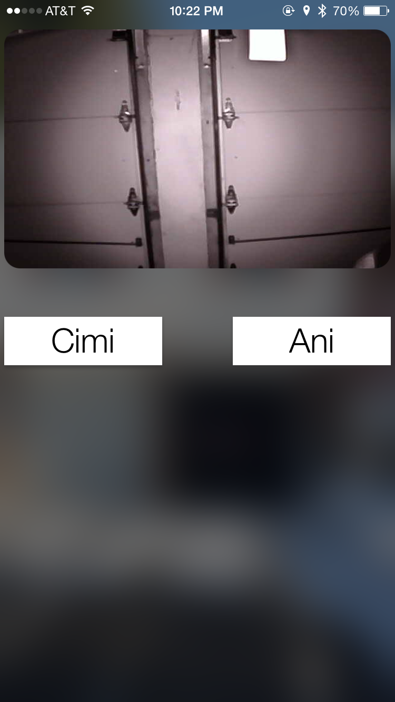
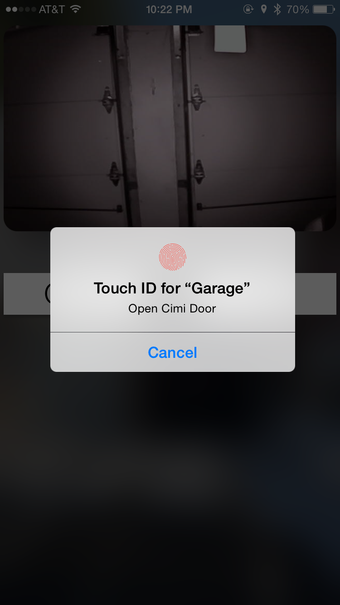
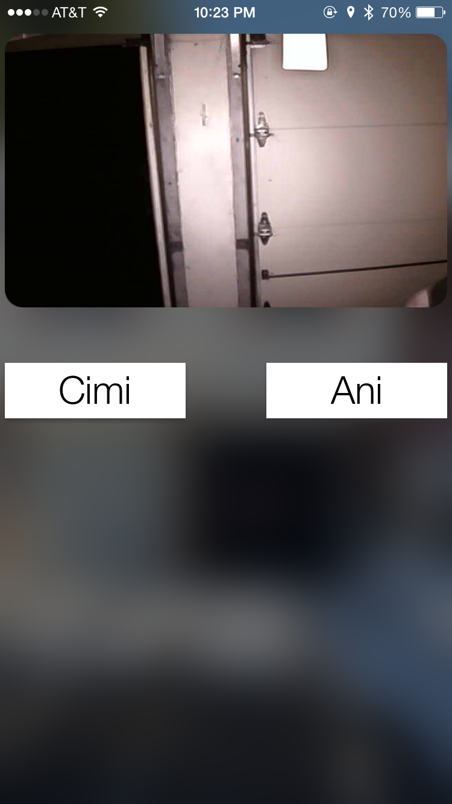

### Introduction

Doorman Remote is an example iOS app used to interact with the [Doorman](https://github.com/nexuist/Doorman) server system. It offers persistent credential storing, MJPEG streaming, and Touch ID support for toggling doors.

In addition, Doorman Remote can also gather and report metrics from the Doorman server in a simple user interface.

### Configuration

All configuration is done in-app. Simply press `configure` in the loading screen to bring up a prompt where you can set the server URL, username, and key.

###### No Backgrounding

Because you're not likely to be using Doorman Remote frequently (how often do you really need to open and close your garage doors?), Doorman Remote will exit upon pressing the home button. This is important to keep in mind if you are copy-pasting credentials. One method to get around this is to paste your credential, press save, and then exit and copy your next credential and repeat. This may be a little annoying, but credentials only need to be set up once.

### Screenshots


###### Previous Version

This is not the first version of Doorman Remote (it is the first public one, however). Here are screenshots of a previous version.







### License

```
MIT License

Copyright (c) 2016 Andi Andreas

Permission is hereby granted, free of charge, to any person obtaining a copy
of this software and associated documentation files (the "Software"), to deal
in the Software without restriction, including without limitation the rights
to use, copy, modify, merge, publish, distribute, sublicense, and/or sell
copies of the Software, and to permit persons to whom the Software is
furnished to do so, subject to the following conditions:

The above copyright notice and this permission notice shall be included in all
copies or substantial portions of the Software.

THE SOFTWARE IS PROVIDED "AS IS", WITHOUT WARRANTY OF ANY KIND, EXPRESS OR
IMPLIED, INCLUDING BUT NOT LIMITED TO THE WARRANTIES OF MERCHANTABILITY,
FITNESS FOR A PARTICULAR PURPOSE AND NONINFRINGEMENT. IN NO EVENT SHALL THE
AUTHORS OR COPYRIGHT HOLDERS BE LIABLE FOR ANY CLAIM, DAMAGES OR OTHER
LIABILITY, WHETHER IN AN ACTION OF CONTRACT, TORT OR OTHERWISE, ARISING FROM,
OUT OF OR IN CONNECTION WITH THE SOFTWARE OR THE USE OR OTHER DEALINGS IN THE
SOFTWARE.
```
