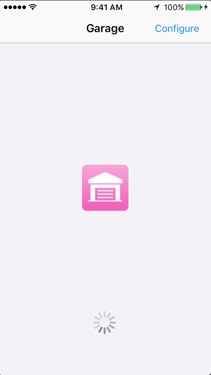
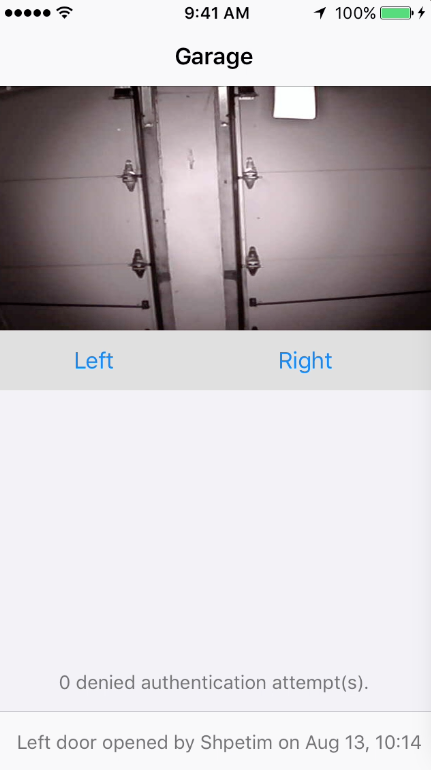
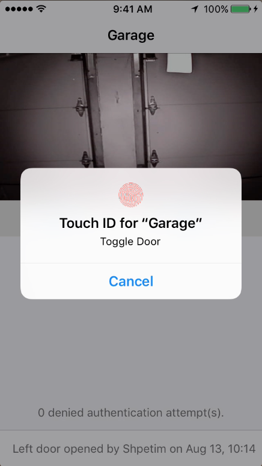

### Introduction

Doorman Remote is an example iOS app used to interact with the [Doorman](https://github.com/nexuist/Doorman) server system. It offers persistent credential storing, MJPEG streaming, and Touch ID support for toggling doors.

In addition, Doorman Remote can also gather and report metrics from the Doorman server in a simple user interface.

### Configuration

All configuration is done in-app. Simply press configure in the loading screen to bring up a prompt where you can set the server URL, username, and key.

###### No Backgrounding

Because you're not likely to be using Doorman Remote frequently (how often do you really need to open and close your garage doors?), Doorman Remote will exit upon pressing the home button. This is important to keep in mind if you are copy-pasting credentials. One method to get around this is to paste your credential, press save, and then exit and copy your next credential and repeat. This may be a little annoying, but credentials only need to be set up once.

### Screenshots

###### Previous Version

This is not the first version of Doorman Remote (it is the first public one, however). Here are screenshots of a previous version.
